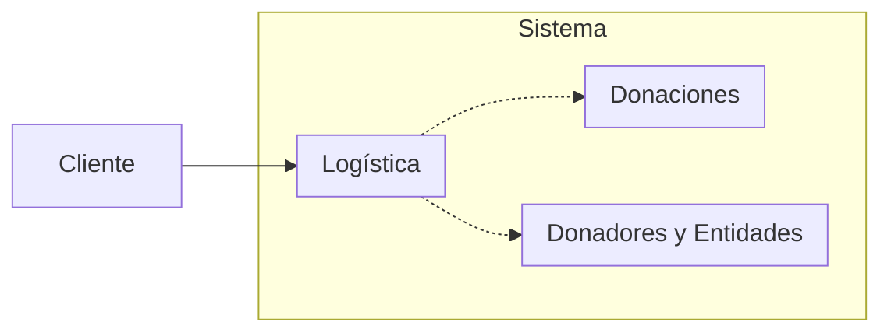

```mermaid
graph LR

Cliente["Cliente"]

subgraph sistema["Sistema"]

    subgraph DonadoresYEntidades["Donadores y Entidades"]
        end
    subgraph Donaciones["Donaciones"]
        end
    subgraph Logistica["Logística"]
        end
    end

    Cliente --> Logistica
    Logistica -.-> Donaciones 
    Logistica -.-> DonadoresYEntidades 
```
