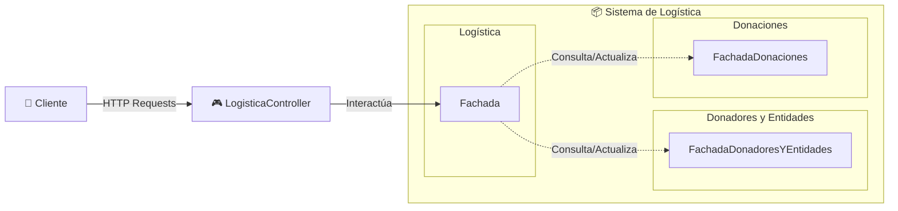

```mermaid
graph LR

Cliente["👤 Cliente"]
Controller["🎮 LogisticaController"]

subgraph sistema["📦 Sistema de Logística"]
    subgraph Logistica["Logística"]
        Fachada["Fachada"]
    end
    subgraph DonadoresYEntidades["Donadores y Entidades"]
        FachadaDE["FachadaDonadoresYEntidades"]
    end
    subgraph Donaciones["Donaciones"]
        FachadaDon["FachadaDonaciones"]
    end
end

Cliente -->|HTTP Requests| Controller
Controller -->|Interactúa| Fachada
Fachada -.->|Consulta/Actualiza| FachadaDon
Fachada -.->|Consulta/Actualiza| FachadaDE
```
