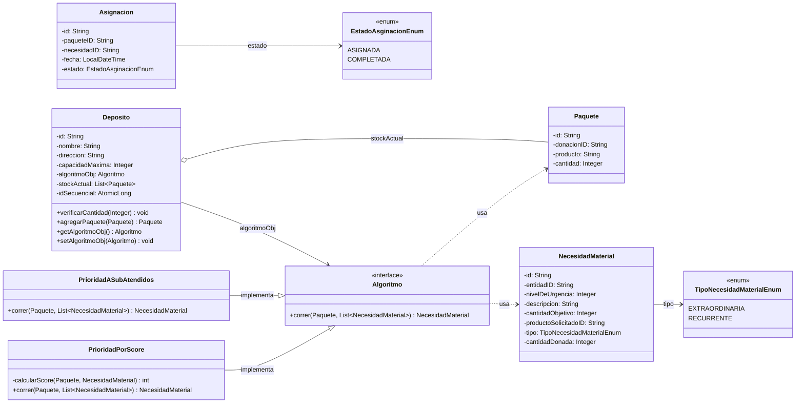

```mermaid
classDiagram
    direction LR
    
    class Deposito {
        -id: String
        -nombre: String
        -direccion: String
        -capacidadMaxima: Integer
        -algoritmoObj: Algoritmo
        -stockActual: List~Paquete~
        -idSecuencial: AtomicLong
        +verificarCantidad(Integer) void
        +agregarPaquete(Paquete) Paquete
        +getAlgoritmoObj() Algoritmo
        +setAlgoritmoObj(Algoritmo) void
    }

    class Paquete {
        -id: String
        -donacionID: String
        -producto: String
        -cantidad: Integer
    }

    class NecesidadMaterial {
        -id: String
        -entidadID: String
        -nivelDeUrgencia: Integer
        -descripcion: String
        -cantidadObjetivo: Integer
        -productoSolicitadoID: String
        -tipo: TipoNecesidadMaterialEnum
        -cantidadDonada: Integer
    }
    
    class Asignacion {
        -id: String
        -paqueteID: String
        -necesidadID: String
        -fecha: LocalDateTime
        -estado: EstadoAsginacionEnum
    }

    class EstadoAsginacionEnum {
        <<enum>>
        ASIGNADA
        COMPLETADA
    }

    class TipoNecesidadMaterialEnum {
        <<enum>>
        EXTRAORDINARIA
        RECURRENTE
    }

    class Algoritmo {
        <<interface>>
        +correr(Paquete, List~NecesidadMaterial~) NecesidadMaterial
    }

    class PrioridadASubAtendidos {
        +correr(Paquete, List~NecesidadMaterial~) NecesidadMaterial
    }

    class PrioridadPorScore {
        -calcularScore(Paquete, NecesidadMaterial) int
        +correr(Paquete, List~NecesidadMaterial~) NecesidadMaterial
    }

    Deposito o-- Paquete : stockActual
    Deposito --> Algoritmo : algoritmoObj
    
    Asignacion --> EstadoAsginacionEnum : estado

    Algoritmo ..> Paquete : usa
    Algoritmo ..> NecesidadMaterial : usa
    
    PrioridadASubAtendidos --|> Algoritmo : implementa
    PrioridadPorScore --|> Algoritmo : implementa
    
    NecesidadMaterial --> TipoNecesidadMaterialEnum : tipo
```
