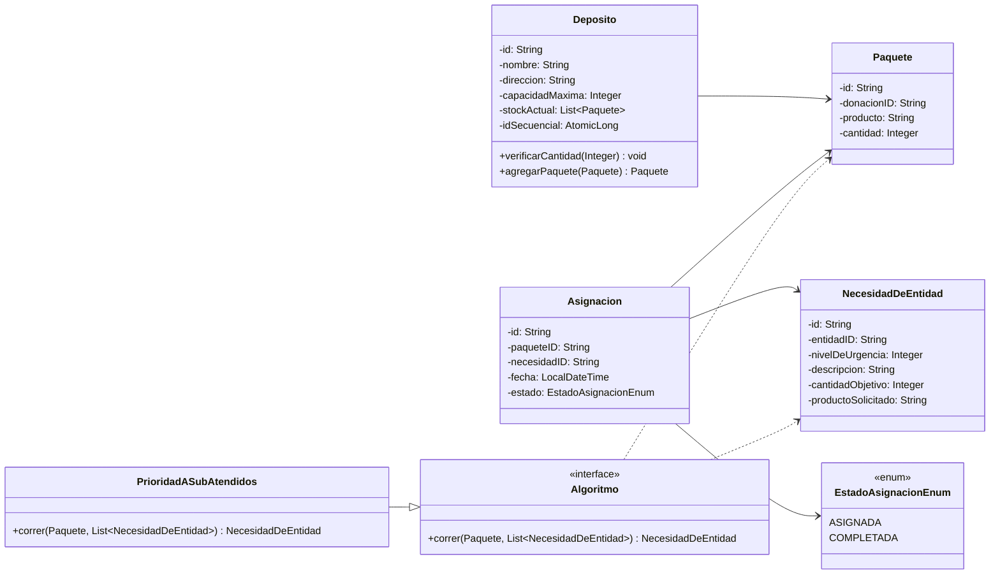

```mermaid
classDiagram
    direction LR
    
    class Deposito {
        -id: String
        -nombre: String
        -direccion: String
        -capacidadMaxima: Integer
        -stockActual: List~Paquete~
        -idSecuencial: AtomicLong
        +verificarCantidad(Integer) void
        +agregarPaquete(Paquete) Paquete
    }

    class Paquete {
        -id: String
        -donacionID: String
        -producto: String
        -cantidad: Integer
    }

    class NecesidadDeEntidad {
        -id: String
        -entidadID: String
        -nivelDeUrgencia: Integer
        -descripcion: String
        -cantidadObjetivo: Integer
        -productoSolicitado: String
    }
    
    class Asignacion {
        -id: String
        -paqueteID: String
        -necesidadID: String
        -fecha: LocalDateTime
        -estado: EstadoAsignacionEnum
    }

    class EstadoAsignacionEnum {
        <<enum>>
        ASIGNADA
        COMPLETADA
    }

    
    class Algoritmo {
        <<interface>>
        +correr(Paquete, List~NecesidadDeEntidad~) NecesidadDeEntidad
    }

    class PrioridadASubAtendidos {
        +correr(Paquete, List~NecesidadDeEntidad~) NecesidadDeEntidad
    }

    Deposito --> Paquete 

    Asignacion --> Paquete
    Asignacion --> NecesidadDeEntidad 
    Asignacion --> EstadoAsignacionEnum 

    Algoritmo ..> Paquete
    Algoritmo ..> NecesidadDeEntidad 
    PrioridadASubAtendidos --|> Algoritmo
```
